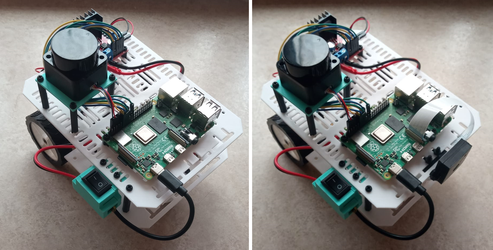
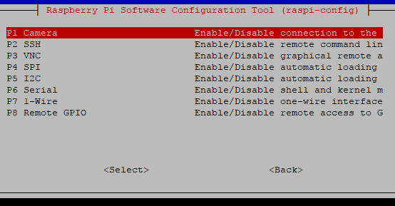

# KRECIC (Knowledge and Robotics Educational Companion for Interactive Computing) | A Modular Wheeled Robot for Educational Usage
## ELEE1036 Individual Project at the University of Greenwich | Academic Year 2023/24

<p align="center">
  
</p>

## Table of Contents
- [Introduction](#introduction)
- [Hardware Setup](#hardware-setup)
  - [Components](#components)
  - [Manufacturing](#manufacturing)
  - [Assembly](#assembly)
- [Software Setup](#software-setup)
  - [Operating System](#operating-system)
  - [Robot Operating System](#robot-operating-system)
  - [Motor and Movement Control](#motor-and-movement-control)
  - [Camera Module](#camera-module)
  - [LiDAR Module](#lidar-module)
- [Contributors](#contributors)
- [License](#license) 

## Introduction
This project has been developed as a final year project for the BEng in Computer Engineering (Hons) at the University of Greenwich (Academic Year 2023/24). 

This project can only be used for educational purposes and it cannot be used for commercial purposes. All credits must be given to the creator and the University of Greenwich. 

This document presents an overview of both the hardware and software setups to successfully re-create this project. This repository is organised into two predominant sections: (a) hardware and (b) software.

## Hardware Setup
This sections outlines the necessary steps in successfully setting up KRECIC's hardware components. 

Keep in mind, that KRECIC has been designed with modularity and evolution in mind. Therefore, the exact components are not necessary. 

### Components
Consider the [Bill of Materials (BOM)](/krecic_design/electronics/KRECIC_BOM.pdf) of all electronics you may need to get started with the building of KRECIC.

### Manufacturing 
To successfully manufacture the 3D printable components found [here](/krecic_design/stl_files/), you will require either an FDM or resin printer. The following components are recommended to be manufactured using TPU, the other components may be manufactured using PLA, ABS, or PETG:
- [Tyre](/krecic_design/stl_files/tyre.stl)
- [Camera Case Front](/krecic_design/stl_files/raspi_camera_front.stl)
- [Camera Case Back](/krecic_design/stl_files/raspi_camera_back.stl)

### Assembly
When all components are acquired, the assembly process is straight forward. However, consider using a solder and shrink tubes for appropriately connecting the power switch to the main circuit. 

## Software Setup
The next section focuses on the basic software setup of KRECIC, allowing the user to test components and consequently perform educational exercises. 

### Operating System
The operating system used for this project has been Ubuntu 22.04. Consider following instructional steps [here](https://ubuntu.com/tutorials/how-to-install-ubuntu-desktop-on-raspberry-pi-4#1-overview)

### Robot Operating System (ROS2)
KRECIC uses Robot Operating System 2 Humble Hawksbill. Please consider the following installation guide from ROS2:

[Click here for ROS2 Humble Installation Guide](https://docs.ros.org/en/humble/Installation/Ubuntu-Install-Debians.html)

### Motor and Movement Control
To test motor control please follow the circuit setup as demonstrated in the following diagrams, [click here](/krecic_design/electronics/diagrams/testing_circuits/motor_test_diagrams.pdf)

Upon successful circuit setup, start with the single motor test, then follow up with the double motor test. Lastly, you can control KRECIC using OpenSSH (as long as both KRECIC's raspberry pi, and your main machine are on the same network). [Click here](/krecic_code/motor_control/) to explore the motor control tests.

### Camera Module
To successfully mount and test the camera module, follow the following steps: 

1. Connect the camera module to the Raspberry Pi: 
    <p align="center">
      
    </p>

2. Verify Camera Connection and Permissions:
    
    After connecting the camera module to the Raspberry Pi, confirm that the camera is recognised using the following:

    ```
    vcgencmd get_camera
    ```

    The output of this command should produce the following output:

    ```
    supported=1 detected=1
    ```
    
    Check if your username has access to the camera by using the following command:

    ```
    groups 
    ```

    The output of this command should `video`. If not, use the following command to add your username to the `video` group:

    ```
    sudo usermod -aG video <your_username>
    ```

3. Install `raspi-config`:

    ```
    sudo apt install raspi-config
    sudo raspi-config
    ```

4. Enable `Legacy Camera`, `SPI`, and `I2C` in Interface Options

    <p align="center">
      
    </p>
  
    Restart your Raspberry Pi.  


5. Install FFMPEG

    Multiple softwares can be installed to test the functionality of the camera. The camera module can be tested with `libcamera`, `ros2`, `opencv`, etc. This tutorial uses `ffmpeg`.

    ```
    sudo apt install ffmpeg
    ```


5. Perform Picture Test

    ```
    ffmpeg -f video4linux2 -i /dev/video0 -vframes 1 test_image.jpg
    ```

6. Perform Video Recording Test

    ```
    ffmpeg -f video4linux2 -i /dev/video0 -t 10 -c:v libx264 test_video.mp4
    ```

7. Perform Live Stream Test

    ```
    ffmpeg -f video4linux2 -i /dev/video0 -f mpegts - | ffplay -
    ```

### LiDAR Module

## Contributors
- [@WJOchman](https://github.com/WJOchman)

## License
<p xmlns:cc="http://creativecommons.org/ns#" >This work is licensed under <a href="http://creativecommons.org/licenses/by-nc-sa/4.0/?ref=chooser-v1" target="_blank" rel="license noopener noreferrer" style="display:inline-block;">CC BY-NC-SA 4.0</a></p>
